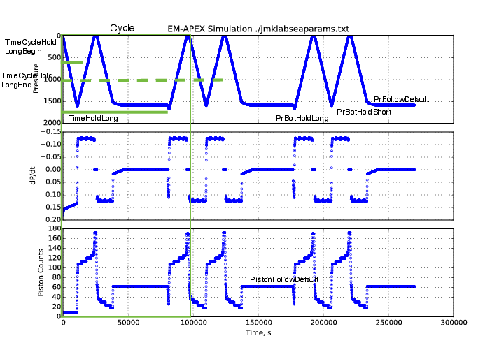

# Programming notes  Lab Sea

See [MissionParams/runSim.sh](./MissionParams/runSim.sh), [./MissionParams/PlanMission.ipynb](./MissionParams/PlanMission.ipynb), and [./MissionParams/GetBallastPoints.ipynb](./MissionParams/GetBallastPoints.ipynb)

This was figured out with reference to `emasim.py`.  Hopefully this is relatively consistent with the control files on the floats:

A "cycle" starts on a down profile.  Always.

When the float is ready for a down profile, it checks the time.  If the time is less than `TimeCycleStart+TimeCycleHoldLongBegin` then a "short" cycle is run.  The Pressure will be set to `PrBotHoldShort` and the float will descend to that depth, and then return to the sruface.  After telemetry, the float will check the time again, and repeat a short cycle if time is still less than `TimeCycleStart+TimeCycleHoldLongBegin`.

If the time is greater than this, it will start a "Long" hold cycle.  It will profile to `PressureFollowDefault`, and then adjust its piston to `PistonFollowDefualt`.  This piston position sets the depth the float will remain at until time is greater than `TimeCycleStart+TimeHoldLong`. As soon as the time is greater than this, the float moves to `PrBotHoldLong`, and then ascends to finish the profile and the cycle.

John Dunlap Notes that we don't want the pressure set by `PistonFollowDefault` to be too close to `PrBotHoldLong` or an internal wave could push the float below `PrBotHoldLong` and terminate the hold.  

There is another variable `TimeCycleHoldLongEnd`.  The float will not do the long profile if the time is greater than this.  So if you set this to something short, it will simply do short cycles.

To get half-inertial pairs: For our latitude we want the profiles to be 14.35/2 h apart =7.175 h = 25830 s. We woudl also like a pair every 10 d, or 864000 s apart.

So, we set `TimeHoldLong` to be 10days minus the time it takes for
  1. the float to get to `PrBotHoldLong` from its hold depth (set by the `PistonFollowDefault`).
  2. the time to get to the surface.
  3. the time on the surface.

To get the half inertial pairs, we simply set the `PrBotHoldShort` to be the right depth to get about the right time.

```python

cycle = 100000 #s this is what we'd like (we won't get it)
surftime = 30.*60.
holddepth = 1550. # get this from a simulation.  It is set by `PistonFollowDefault`
PrBotHoldLong = 1610.
speed = 0.12

# how deep can we go to get the inertial pair?
dt = 14.35*3600./2.
print dt
dt = dt-surftime # subtract the transmit
PrBotHoldShort = dt*speed/2.
print('PrBotHoldLong: %1.0f dbar'% np.round(PrBotHoldLong))
print('PrBotHoldShort: %1.0f dbar'% np.round(PrBotHoldShort))

# get TimeHoldLong
TimeHoldLong = cycle-np.abs(PrBotHoldLong-holddepth)/speed \
  -PrBotHoldLong/speed \
            -surftime
print(PrBotHoldLong/speed)
print('TimeHoldLong: %1.0f'%np.round(TimeHoldLong))

# get the maximum TimeCycleHoldLongBeg
TCHLB = 2.*PrBotHoldShort/speed
print('TimeCycleHoldLongBeg should be less than %d'%round(TCHLB))
print('TimeDescentProfHoldLong should be greater than %d'%round(cycle))

```

